# css部分属性

## 文本属性

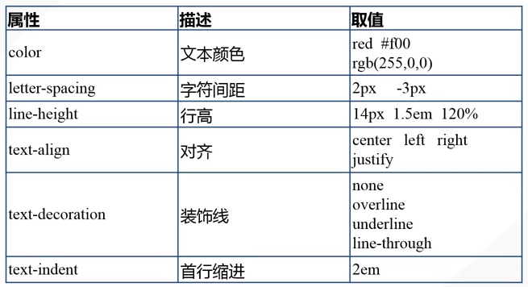

`Tips`

1. 一行字居中可以用 line-height 等于父容器的 height
2. <a>不要下划线可以用 text-decoration:none

## 字体属性

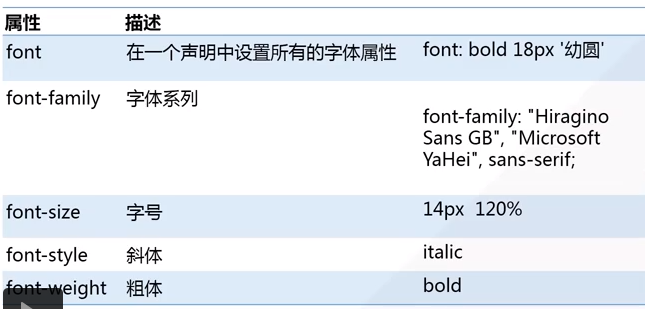
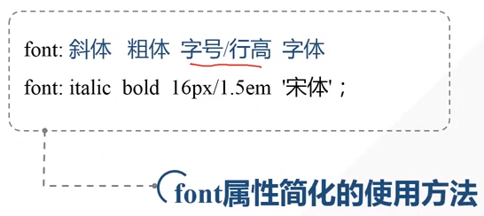

## 背景

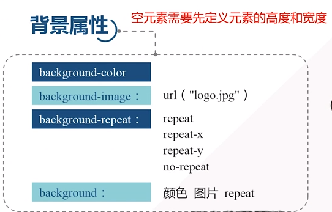

`Tips`

1. 背景图片的填充方式 background-repeat:no-repeat

## 超链接

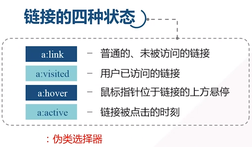

`Tips`

1. CSS超链接必须按一下顺序定义属性：link > visited > hover > active (`L`o`v`e & `Ha`te)

## 列表
|列表|list-style-type|list-style-position|
|-:-|-:-|-:-|
|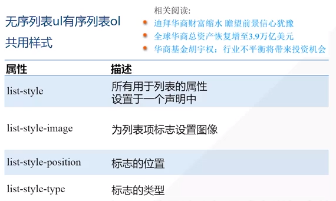|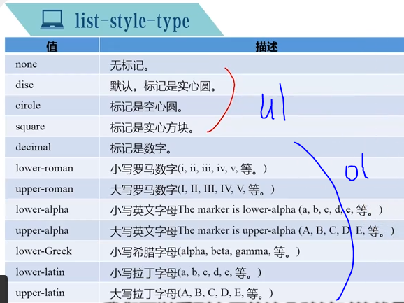|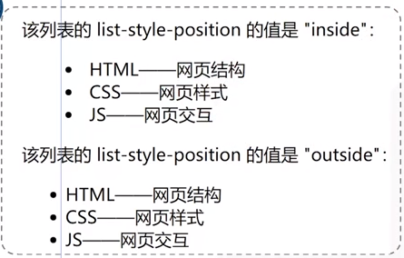|

`Tips`

1. list-style-image: url("路径");

## 表格

`Tips`

1. 表格边框合并： border-collapse:collapse
2. 表格边框样式： ```table,td,th{ border: 1px solid #fff; }```
3. 奇偶选择器隔行显示不同颜色：```tr:nth-child(odd|even){background-color:#eee;}```
	
# css布局与定位

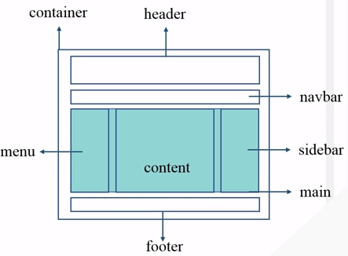

## 盒子模型

|盒子模型|具体属性|
|-：-|-：-|
|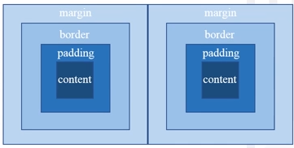|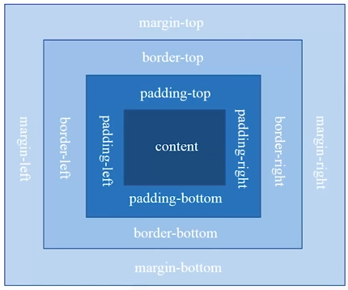|

`Tips`

1. margin属性上下合并，左右不合并（取margin-top和margin-bottom较大的距离作为上下间距)；水平方向不合并

### overflow

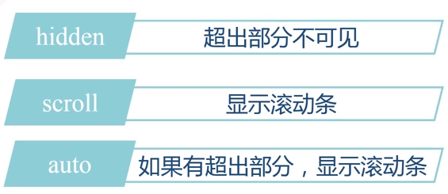 

### border

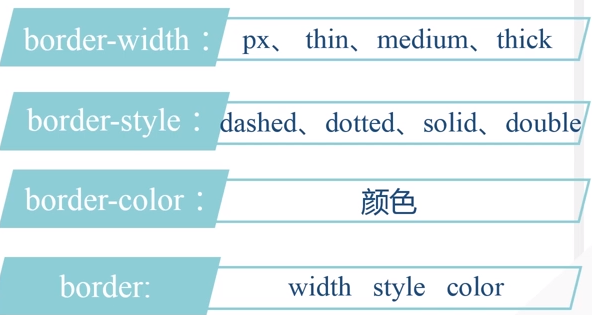

### 水平居中

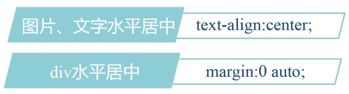

## 定位机制

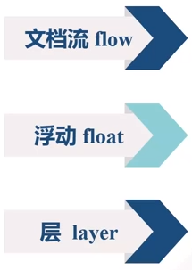

### 文档流定位

`Tips`

1. 文档流定位三种方式：block、inline、inline-block
2. block独占一行，可以设置宽高，例如div、table、ul、ol、p等
3. inline不独占一行，不可以设置宽高，例如span、a
4. inline-bloc不独占一行，可以设置宽高，例如img
