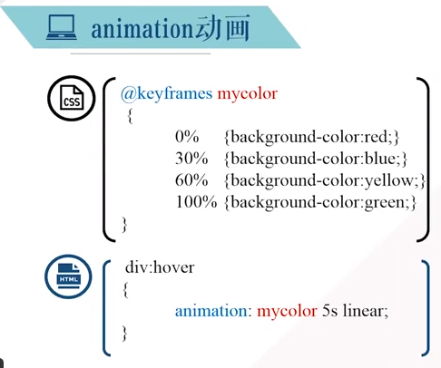

# css3新特性

## border-radius\|圆角

`Tips`

1. border-top-left-radius \|border-top-right-radius \|border-bottom-left-radius \|border-bottom-right-radius
2. 四个属性格式：x y（水平方向长度和垂直方向长度）

## box-shadow\|阴影

`Tips`

1. 格式：inset\|outset 水平偏移 垂直偏移 模糊距离 颜色

## 文本与字体

### text-shadow

`Tips`

1. 格式与box-shadow一致

### word-wrap

`Tips`

1. 允许长单词和url换行
2. normal\|break-word（不换行\|换行）

### @font-face规则

## 2D转换

`Tips`

1. transform:rotate(x deg) 顺时针旋转x度
2. transform:scale(x,y) x:水平方向缩放的倍数，y:垂直方向缩放的倍数，0~1缩小，>1放大
3. 鼠标悬停放大 div:hover{transform:scale(1.2)}

## 过渡与动画

### 过渡transition

### 动画animation

## 3D变换

`示例`

|示例1|示例2|
|:-|:-|
|||