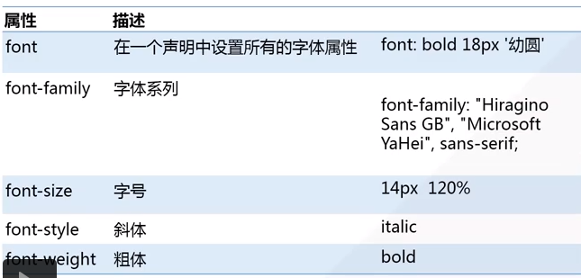
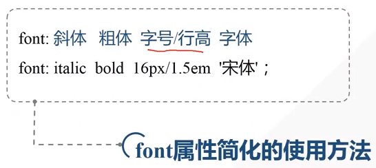
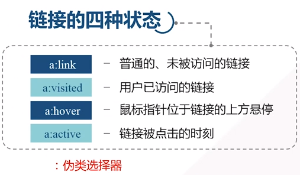

# 文本属性


`Tips`

1. 一行字居中可以用 line-height 等于父容器的 height
2. <a>不要下划线可以用 text-decoration:none

# 字体属性




# 背景


`Tips`

1. 背景图片的填充方式 background-repeat:no-repeat

# 超链接



`Tips`

1. CSS超链接必须按一下顺序定义属性：link > visited > hover > active (`L`o`v`e & `H``a`te)

# 列表


`Tips`

1. list-style-image: url("路径");

# 表格

`Tips`

1. 表格边框合并： border-collapse:collapse
2. 表格边框样式： ```table,td,th{ border: 1px solid #fff; }```
3. 奇偶选择器隔行显示不同颜色：```tr:nth-child(odd|even){background-color:#eee;}```
	

