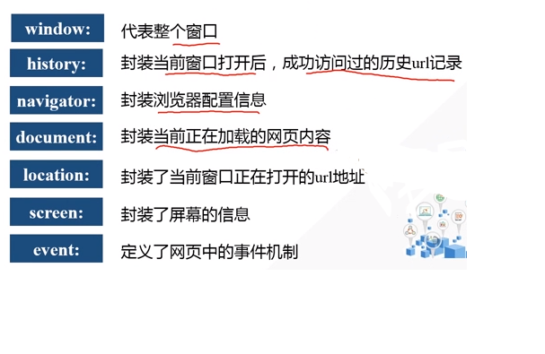

# Javascript

## JS简介

### JS构成

* 核心ECMAScript
* 文档对象模型DOM(Document Object Model)
* 浏览器对象模型BOM(Browser Object Model)

### JS特点

1. 开发工具简单
2. 弱类型语言由数据决定数据类型
3. 无需编译，直接由JS引擎负责执行
4. 面向对象

### 浏览器内核作用

1. 内容排版引擎解析HTML和CSS
2. 脚本解释引擎解析JS

### JS运行环境

1. 独立解析引擎：NodeJS
2. 嵌入浏览器内核中的引擎

## 数据类型

### 五种类型

* 数字\|number
* 字符串\|string
* 布尔\|boolean
* 空\|null
* 未定义\|undefined

### 数据转换

`Tips`

1. 隐式转换
2. 强制转换: toString()、parseInt()、parseFloat()、Number()

### 运算符和表达式

`Tips`

1. == 不比较类型，只比较数值
2. === 既比较类型，也比较数值
3. 三目运算符：a = 表达式1 ？ 表达式2 ： 表达式3(1真或假，真a赋值2，假a赋值3)

## 函数

### 函数定义

函数是一段`预定义`的，并可以`反复使用`的`代码块`。

### 函数声明

function 函数名(形参){`...`}

### 函数调用

函数名(实参)

### 作用域

`Tips`

1. 函数传参实际上是`按值传递`，传参是把实参复制一份副本传到函数内部，内部改变参数值，实参不会改变。

## 数组

### 数组类型

* 索引数组 var a = new Array(); var a = []; a[索引] = value;
* 关联数组 var a = []; a[key] = value;

## 数组API

### 数组转字符串

1. String(arr)：把数组转为字符串，中间用','连接
2. arr.join(“连接符”)：连接符自定义，默认是','

### 拼接和选取

1. arr1.concat(arr2,50,100,...)：数组拼接，返回新数组
2. arr1.slice(starti,endi+1)：含头不含尾选取返回新数组

`Tips`

复制数组的三种方法

1. var arr1 = arr2;
2. var arr1 = arr2.concat();
3. var arr1 = arr2.slice(0,arr2.length);

### 修改数组

1. arr.splice(starti,num,replace)：从starti下标开始，用replace代替num个元素

### 颠倒数组

1. arr.reverse();

### 数组排序

1. arr.sort()：将所有元素转换为字符串再排序，可以自定义排序规则

## BOM

### 定时器

1. 周期性定时器

# Javascript
	var timer = setInterval(function(){...},interval);
	clearInterval(timer);

2. 一次性定时器

# Javascript
	setTimeout(function(){...},time);