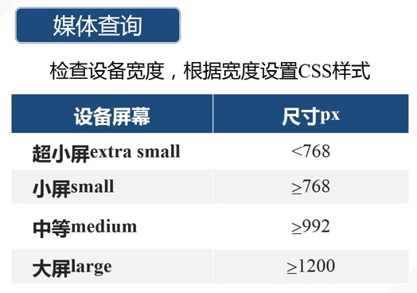

# 响应式布局

## 布局方式

* 固定宽度（像素）
* 流式（百分比）
* 响应式（检测设备信息，设置不同宽度）
* 混合

## 响应式布局实现方法

### CSS3

`Media Query`

meta viewport扩展

<meta name="viewport" content="width=device-width,user-scalable=no,initial-scale=1.0,maximum-scale=1.0,minimum-scale=1.0">

### 第三方开源框架

`Bootstrap4`